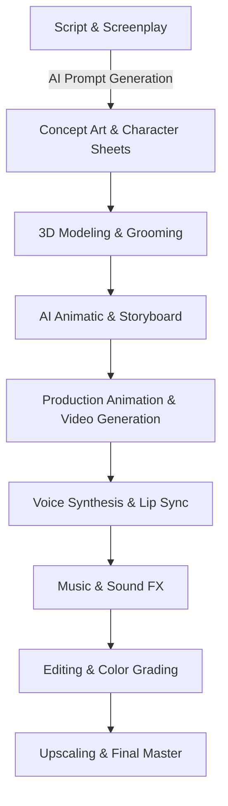

# THE RAMAYANA OF VALMIKI — COMPLETE PRODUCTION GUIDE
## Premium 3D Animated Cinematic Series Blueprint

---

## 1. SERIES GUIDE

### Series Overview
*Ramayanam* is a premium 21-episode 3D animated web series that reimagines the ancient Sanskrit epic through a high-end cinematic anime lens. Designed for modern streaming platforms (OTT) and targeted at a global family audience, the series balances strict scriptural authenticity with state-of-the-art visual storytelling. The production features a unique visual style combining Pixar's warm character expressiveness with the dynamic action choreography and emotional depth of modern Japanese cinematic anime (e.g., Ufotable, Studio Ghibli).

### Core Themes
*   **Dharma (Duty and Righteousness):** The central pillar. Exploring the complex choices characters make when personal desires conflict with moral and social duties.
*   **Devotion and Loyalty:** Exemplified by Lakshmana, Sita, Bharata, and Hanuman, showcasing selflessness and unconditional love.
*   **The Nature of Evil:** Evil is represented not just as physical monsters, but as a result of ego, uncontrolled desires, and pride (Ravana), showing that righteousness (*Dharma*) must conquer internal as well as external darkness.
*   **Spiritual Transformation:** The evolution of the soul, from the raw power of ascetics to the serene, unwavering peace of Rama.

### Story Philosophy
Our adaptation is based strictly on the Valmiki Ramayana, stripping away later Puranic additions to reveal the core human drama and epic scale of the original text. Rama is not portrayed as an all-powerful god who knows the future, but as a noble prince who must endure intense human suffering, grief, and moral dilemmas, making his adherence to *Dharma* all the more heroic.

### Emotional Journey
The series tracks a dramatic arc starting from childhood wonder and martial triumph (Bala Kanda), moving into political heartbreak and the pain of exile (Ayodhya Kanda), transitioning to the mystical dangers of the wilderness (Aranya Kanda), the desperate struggles of a search and alliance (Kishkindha/Sundara Kanda), culminating in an epic war of survival (Yuddha Kanda) and the bittersweet resolution of a righteous reign (Uttara Kanda).

### Audience Expectations
*   **Domestic Viewers:** Authentic pronunciation (Telugu base), scriptural accuracy, and deep emotional resonance with their cultural roots.
*   **International Viewers:** A grand, high-fantasy adventure comparable to *The Lord of the Rings* or *Avatar: The Last Airbender*, featuring rich world-building, clear stakes, and universally relatable emotional dynamics.

### Art Direction
The art style is **"Mythological Neo-Anime"**:
*   Vibrant, highly saturated color palettes reflecting the emotional tone of each Kanda.
*   Sleek, stylized character designs with expressive eyes, fluid movement, and natural textures.
*   Environments that feel grand and organic, with hand-painted textures mapped onto 3D models to create a "painterly cinematic" depth.
*   **Skin Tone Rule:** Only Rama and divine forms of Vishnu/Shiva have a luminous blue-teal complexion. All other characters have natural human skin tones (warm bronze, fair golden, deep brown).

### Animation Direction & Cinematic Style
*   **Framerate:** 24fps with variable step-rates (animating on 1s for fast action, on 2s for quiet dialogues to mimic high-end anime).
*   **Cinematic Style:** Wide-angle anamorphic lenses, dynamic lighting with golden-hour rim lights, deep shadows, and physical camera effects (lens flares, light leaks, realistic depth-of-field).
*   **Visual Identity:** The logo features elegant Sanskrit-derived Telugu typography intertwined with a golden bow (*Kodanda*) and a glowing blue lotus leaf motif.

---

## 2. EPISODE PLAN

### Episode 1: The Divine Call
*   **Approx. Runtime:** 15:30
*   **Logline:** Desperate for an heir to the throne of Ayodhya, King Dasharatha performs a sacred fire ritual, leading to the birth of four divine princes.
*   **Synopsis:** Ayodhya is a golden city but shadowed by the lack of a royal heir. King Dasharatha, advised by Sage Vasishtha, conducts the *Putrakameshti Yajna*. Out of the sacred flames, a divine being emerges offering a golden bowl of payasam. The queens consume it, leading to the birth of Rama, Lakshmana, Bharata, and Shatrughna. The princes grow up learning scripture and martial arts, with Rama establishing an unbreakable bond with Lakshmana.
*   **Beginning:** A cinematic sweep over Ayodhya at sunset. Dasharatha looks out from his balcony, his face heavy with sorrow as he realizes his dynasty might end with him.
*   **Middle:** The grand *Putrakameshti Yajna*. Sages chant in unison, the fire grows into a brilliant gold-and-white pillar, and the fire god Agni presents the divine payasam.
*   **Ending:** The birth and childhood montage of the four princes. Rama, a young boy with luminous blue-teal skin, shoots his first toy arrow into the sky, where it sparkles like a star.
*   **Major Emotional Moments:** Dasharatha’s tears of joy upon holding newborn Rama; Rama sharing his toys with Lakshmana.
*   **Important Dialogues:** Vasishtha: *"O King, the heavens have heard your plea. Righteousness shall take birth in your halls."*
*   **Fight Scenes:** None.
*   **Comedy Moments:** Toddler Rama chasing a golden butterfly, tripping and laughing as Lakshmana tries to catch him.
*   **Character Growth:** Dasharatha transforms from a grieving old ruler to a proud father.
*   **Ending Cliffhanger:** Sage Vishwamitra’s shadow falls across the palace gates as a guard runs in to announce his unexpected arrival.

### Episode 2: The Sage’s Request
*   **Approx. Runtime:** 14:45
*   **Logline:** The legendary warrior-sage Vishwamitra arrives in Ayodhya, demanding the young prince Rama to protect his sacred hermitage from terrifying demons.
*   **Synopsis:** Sage Vishwamitra demands that Rama, only a teenager, accompany him to the forest to slay the rakshasas Tataka, Maricha, and Subahu who desecrate his sacrifices. Dasharatha refuses in fear, but Vasishtha intervenes, reminding the king of his duty. Rama and Lakshmana leave their royal lives behind, walking barefoot behind the fierce sage into the unknown wilderness.
*   **Beginning:** Vishwamitra enters the court, his golden aura pulsing with power. Dasharatha bows low, offering anything.
*   **Middle:** Vishwamitra asks for Rama. Dasharatha panics: *"My Rama is not yet sixteen! He cannot face demons!"* Vishwamitra rises in anger, causing the room to tremble.
*   **Ending:** Rama and Lakshmana, dressed in simple dhotis, carrying their bows, step out of the gates of Ayodhya, following Vishwamitra into the dark, tangled forest.
*   **Major Emotional Moments:** Dasharatha hugging Rama tightly before letting him go; Kaushalya’s silent tears as she watches her son leave.
*   **Important Dialogues:** Vishwamitra: *"Do not measure his strength by his years, King. He is born for this."*
*   **Fight Scenes:** None.
*   **Comedy Moments:** Lakshmana trying to mimic Vishwamitra's stern walk, making Rama smile.
*   **Character Growth:** Rama accepts his duty without hesitation, showing the first signs of his path as a protector of Dharma.
*   **Ending Cliffhanger:** A terrifying roar echoes through the trees, and the sky darkens as a flock of black birds rises.

### Episode 3: The Forest Demoness
*   **Approx. Runtime:** 15:15
*   **Logline:** Entering the cursed forest of Malada, Rama must overcome his hesitation to slay the terrifying demoness Tataka.
*   **Synopsis:** Vishwamitra guides the princes into the cursed territory of Tataka. The sage instructs Rama to slay her. Rama hesitates to kill a woman, but Vishwamitra explains that a protector must eliminate threats to the innocent, regardless of gender. Tataka attacks with a storm of stones. Rama shoots his arrows, pinning her, and finally shoots a fatal arrow through her chest, restoring peace to the forest.
*   **Beginning:** The landscape shifts from green woods to a dead, twisted forest filled with bones and gray mist.
*   **Middle:** Tataka emerges—a towering, shriveled demoness with claws and wild grey hair. She hurls massive boulders. Lakshmana shoots arrows to break the stones, while Rama defends.
*   **Ending:** Rama, guided by Vishwamitra’s words, focuses, draws his bow, and releases a glowing arrow. Tataka falls, dissolving into black dust as flowers rain from the sky.
*   **Major Emotional Moments:** Rama’s internal struggle before drawing his bow; the relief of the forest spirits.
*   **Important Dialogues:** Vishwamitra: *"A king's duty is to protect the righteous. Compassion for the wicked is a sin against the innocent."*
*   **Fight Scenes:** The battle against Tataka: dynamic camera moves, slow-motion arrows, and particle effects for the dust storm.
*   **Comedy Moments:** None.
*   **Character Growth:** Rama learns to prioritize his duty as a warrior over his personal hesitation.
*   **Ending Cliffhanger:** Vishwamitra presents Rama with glowing divine weapons (*Astras*), which float in the air, waiting for his touch.

### Episode 4: The Sacred Sacrifice
*   **Approx. Runtime:** 15:00
*   **Logline:** Rama and Lakshmana stand guard at Vishwamitra’s hermitage, facing a massive demonic assault led by Maricha and Subahu.
*   **Synopsis:** The princes guard the sacrificial altar for six days. On the final day, the sky turns blood-red as Maricha and Subahu launch an attack. Rama uses the *Manavastra* to hurl Maricha hundred leagues into the ocean and slays Subahu with the *Agneyastra*. The yajna is completed successfully, and Vishwamitra invites the princes to Mithila to see a legendary bow.
*   **Beginning:** The peaceful Siddhashrama. The sages start the fire ritual. Rama and Lakshmana stand alert on rocks, scanning the skies.
*   **Middle:** The demon horde attacks. Subahu rains blood and filth onto the altar. Lakshmana engages the minor demons, showing incredible speed, while Rama targets the leaders.
*   **Ending:** Rama shoots Maricha, sending him flying across the horizon, then incinerates Subahu. The sages chant in triumph.
*   **Major Emotional Moments:** Lakshmana defending the sacred altar with his body; the deep respect between Rama and the forest sages.
*   **Important Dialogues:** Rama: *"While we draw breath, no shadow shall touch this fire."*
*   **Fight Scenes:** Choreographed archery combat with energy trails, explosions, and tracking shots following the arrows.
*   **Comedy Moments:** Lakshmana wiping demonic goo off his face, muttering about forest hygiene.
*   **Character Growth:** The princes establish themselves as formidable protectors, earning the trust of the sages.
*   **Ending Cliffhanger:** Vishwamitra tells them of the Bow of Shiva in Mithila: *"A bow that no mortal man, god, or demon has ever been able to bend."*

### Episode 5: The Bow of Mithila
*   **Approx. Runtime:** 15:45
*   **Logline:** In the grand kingdom of Mithila, Rama attempts to string the legendary, unyielding Bow of Shiva to win the hand of Princess Sita.
*   **Synopsis:** The princes arrive in Mithila. King Janaka announces that whoever strings the massive Bow of Shiva will marry his daughter Sita. Many kings fail to even move it. Rama steps forward, easily lifts the heavy iron bow, and as he pulls the string, the bow snaps with a thunderous crack. Janaka rejoices, and the wedding is arranged.
*   **Beginning:** Mithila's white marble palace. Rama and Sita catch a brief, silent glimpse of each other across the courtyard, their eyes locking in instant connection.
*   **Middle:** The assembly hall. Five hundred men struggle to wheel in the chest containing the bow. Rama calmly approaches it, prays silently, and lifts it with one hand.
*   **Ending:** Rama pulls the string. The bow breaks in half, creating a shockwave. Sita smiles, holding a golden garland, walking toward him.
*   **Major Emotional Moments:** The tension as Rama lifts the bow; Janaka’s tears of relief; the silent understanding between Rama and Sita.
*   **Important Dialogues:** Janaka: *"My daughter has found her equal. The earth itself rejoices."*
*   **Fight Scenes:** The physical feat of lifting and breaking the massive bow, rendered with intense lighting and sound design.
*   **Comedy Moments:** A proud king trying to lift the bow, throwing his back out, and being carried away.
*   **Character Growth:** Rama demonstrates his extraordinary strength and humility, remaining calm despite the crowd's roar.
*   **Ending Cliffhanger:** On the journey back to Ayodhya, a sudden storm rises, and a towering figure with a glowing red axe blocks their path—Parasurama.

### Episode 6: The Wrath of Parasurama
*   **Approx. Runtime:** 15:10
*   **Logline:** The ferocious avatar Parasurama challenges Rama to a duel of bows, threatening to destroy the royal procession.
*   **Synopsis:** Angry at the breaking of Shiva’s bow, Parasurama demands that Rama string the Bow of Vishnu. If he fails, he must fight him. Rama calmly takes the bow, strings it, and aims a divine arrow at Parasurama's spiritual merits. Realizing Rama's true nature, Parasurama bows in reverence and retires to the mountains, leaving the royal family to return in peace.
*   **Beginning:** Dust storms and lightning. The horses shriek. Parasurama steps forward, surrounded by a crackling red-orange aura.
*   **Middle:** Parasurama mocks Rama’s lineage. Lakshmana steps forward angrily, but Rama gently holds him back. Rama takes the Bow of Vishnu from Parasurama's hands.
*   **Ending:** Rama stands tall, the arrow drawn. The red aura around Parasurama fades into a golden glow as he realizes he has met his match.
*   **Major Emotional Moments:** Rama protecting his father and brothers; Parasurama's realization and peaceful departure.
*   **Important Dialogues:** Rama: *"Forgive me, O Sage, but this arrow must find its target. I aim not for your life, but for the path of your celestial ascension."*
*   **Fight Scenes:** A tense psychological and magical stand-off with wind effects, energy crackles, and extreme close-ups of eyes.
*   **Comedy Moments:** None.
*   **Character Growth:** Rama shows that true strength lies in calm, measured responses, not matching anger with anger.
*   **Ending Cliffhanger:** The grand coronation of Rama as prince regent of Ayodhya is announced by King Dasharatha.

### Episode 7: The Scheming Mind
*   **Approx. Runtime:** 14:50
*   **Logline:** On the eve of Rama's coronation, a bitter maid poison's the mind of Queen Kaikeyi, sparking a royal crisis.
*   **Synopsis:** Ayodhya prepares for Rama’s coronation. The hunchbacked maid Manthara convinces Queen Kaikeyi that Bharata will be sidelined and Rama will exile him. Kaikeyi, initially loving Rama, falls victim to fear. She enters the "chamber of anger," demands that Dasharatha grant the two boons promised to her long ago: exile Rama for 14 years and crown Bharata.
*   **Beginning:** Ayodhya decorated with flowers and golden banners. Joyous music fills the air.
*   **Middle:** Manthara whispering venomous words to Kaikeyi in her chamber, using cards and shadows to depict a dark future for Bharata.
*   **Ending:** Dasharatha enters Kaikeyi’s chamber to find her ornaments shattered on the floor, her hair wild, and her face cold. She demands her boons.
*   **Major Emotional Moments:** Kaikeyi’s gradual corruption from a loving mother to a cold schemer; Dasharatha’s collapse in shock.
*   **Important Dialogues:** Kaikeyi: *"My boons, O King! Crown my Bharata, and send Rama to the forest for fourteen years!"*
*   **Fight Scenes:** None.
*   **Comedy Moments:** None.
*   **Character Growth:** Kaikeyi undergoes a tragic descent into paranoia and greed.
*   **Ending Cliffhanger:** Dasharatha lies weeping on the floor as the morning sun begins to rise on the day of the coronation.

### Episode 8: The Price of a Promise
*   **Approx. Runtime:** 15:20
*   **Logline:** Rama willingly accepts his father's decree of exile, choosing duty and honor over the crown.
*   **Synopsis:** Rama is summoned to his father's chamber. Seeing Dasharatha unable to speak, Kaikeyi delivers the harsh terms. Rama accepts immediately to preserve his father's honor. Lakshmana is furious, wanting to overthrow the king, but Rama calms him. Sita and Lakshmana refuse to let Rama go alone, choosing to join him in the forest.
*   **Beginning:** Rama enters the dark chamber, his bright blue skin contrasting with the dim, sorrowful room.
*   **Middle:** Kaikeyi speaking the words of exile. Rama’s calm face as he responds with a gentle smile: *"I shall go, Mother. My father's word is my command."*
*   **Ending:** Rama, Sita, and Lakshmana remove their royal garments, wear simple bark-cloth, and walk through a weeping crowd out of the city gates.
*   **Major Emotional Moments:** Rama comforting his sobbing mother Kaushalya; Sita refusing to stay in the palace; Lakshmana’s fierce declaration of loyalty.
*   **Important Dialogues:** Rama: *"A crown is transient, Lakshmana. But Dharma is eternal. If my father breaks his promise, the foundation of Ayodhya crumbles."*
*   **Fight Scenes:** None.
*   **Comedy Moments:** None.
*   **Character Growth:** Rama, Sita, and Lakshmana show supreme sacrifice, prioritizing honor and family over personal comfort.
*   **Ending Cliffhanger:** The royal chariot driven by Sumantra leaves the borders of Ayodhya, heading into the dark forest line.

### Episode 9: Crossing the Ganga
*   **Approx. Runtime:** 14:30
*   **Logline:** The exiled royals bid farewell to their royal life, crossing the mighty Ganga with the help of a loyal hunter-king.
*   **Synopsis:** The trio reaches the banks of the Ganga. Guha, the king of the Nishadas, welcomes them with fruits and boats. Rama requests clay to mat his hair, symbolising his ascetic life. They cross the river, sending Sumantra back to Ayodhya with the empty chariot. They step into the deeper wilderness, leaving civilization behind.
*   **Beginning:** Sunset over the Ganga. The chariot stops. Sumantra stands weeping as he prepares to take the empty chariot back.
*   **Middle:** Guha bowing to Rama, offering his kingdom. Rama embraces him as a brother: *"Your friendship is my treasure, Guha, but I must live as a forest dweller."*
*   **Ending:** The boat glides across the misty Ganga at dawn. Rama, Sita, and Lakshmana look back one last time at the fading river bank.
*   **Major Emotional Moments:** Rama matted hair ceremony; the emotional farewell to Sumantra; the quiet moment of Sita praying to the river Ganga.
*   **Important Dialogues:** Sumantra: *"How shall I return to a city that has lost its soul, O Prince?"*
*   **Fight Scenes:** None.
*   **Comedy Moments:** None.
*   **Character Growth:** Rama humbles himself, adapting quickly to the life of an ascetic, while Sita shows resilience.
*   **Ending Cliffhanger:** In Ayodhya, Dasharatha takes his final breath, calling out Rama’s name in the empty palace.

### Episode 10: The Sandals of Devotion
*   **Approx. Runtime:** 15:35
*   **Logline:** Bharata tracks Rama to the forest, begging him to return, but returns with Rama's sandals to place upon the throne.
*   **Synopsis:** Learning of his mother’s deeds, Bharata rejects the crown and goes to the forest with the citizens to find Rama. He finds Rama at Chitrakoot. Bharata begs him to return as king. Rama refuses, citing his vow. Bharata takes Rama’s golden sandals, promising to rule only as his regent from outside the city, living like an ascetic himself.
*   **Beginning:** Bharata finding Rama’s simple hermitage. He runs and falls at Rama’s feet, weeping.
*   **Middle:** The intense debate between the brothers. The sages and citizens watch. Rama explains the sanctity of their father's promise.
*   **Ending:** Bharata carries Rama’s sandals on his head, walking back to Ayodhya. He places them on the empty throne.
*   **Major Emotional Moments:** Bharata condemning Kaikeyi; the tearful embrace of the brothers; the placement of the sandals on the throne.
*   **Important Dialogues:** Rama: *"These fourteen years are not a curse, Bharata. They are a test of our father's truth. Rule the kingdom in my name, and I shall rule the forest."*
*   **Fight Scenes:** None.
*   **Comedy Moments:** None.
*   **Character Growth:** Bharata’s selfless devotion shines, matching Rama’s righteousness.
*   **Ending Cliffhanger:** Rama decides to move deeper into the Dandaka forest to prevent the citizens of Ayodhya from visiting him again.

### Episode 11: The Shadow of Panchavati
*   **Approx. Runtime:** 15:00
*   **Logline:** Settling in the peaceful valley of Panchavati, the royals face a dark threat when a demonic princess targets Sita.
*   **Synopsis:** The exiles build a beautiful cottage at Panchavati. Surpanakha, the sister of Ravana, wanders by. Smitten by Rama’s beauty, she proposes to him in her hideous native form. Rama playfully redirects her to Lakshmana. Insulted and enraged, she lunges to devour Sita. Lakshmana quickly draws his sword and cuts off her nose and ears to protect Sita.
*   **Beginning:** A beautiful spring morning in Panchavati. Sita is watering wildflowers. Rama is carving wooden bowls.
*   **Middle:** Surpanakha enters—a massive, pot-bellied rakshasi with copper hair. She speaks in a harsh grating voice, demanding to marry Rama. Rama laughs, teasing her.
*   **Ending:** Surpanakha lunges at Sita. In a flash, Lakshmana’s sword sweeps through the air. Surpanakha screams, clutching her bleeding face, running into the forest.
*   **Major Emotional Moments:** The sudden shift from peaceful domesticity to terrifying danger; Lakshmana’s protective instinct.
*   **Important Dialogues:** Surpanakha: *"I will devour this golden girl and make you mine!"* Lakshmana: *"Touch her, and your life ends here."*
*   **Fight Scenes:** A split-second action sequence where Lakshmana draws his sword, deflects a claw strike, and inflicts the wound.
*   **Comedy Moments:** Rama gently teasing Surpanakha, suggesting his brother Lakshmana is far more suitable and single.
*   **Character Growth:** Lakshmana shows his readiness to act instantly as a protector.
*   **Ending Cliffhanger:** Surpanakha reaches the camp of her brother Khara, screaming for revenge, as a massive army of 14,000 demons mobilizes.

### Episode 12: The Battle of Janasthana
*   **Approx. Runtime:** 15:50
*   **Logline:** Facing an army of fourteen thousand demons alone, Rama unleashes his divine weapons in a spectacular display of martial prowess.
*   **Synopsis:** Khara and Dushana attack Panchavati with a massive host. Rama orders Lakshmana to guard Sita in a cave. Standing alone on the battlefield, Rama faces the demonic onslaught. Using his Vaishnava bow and divine astras, he decimates the entire army, culminating in a fierce duel where he slays Khara.
*   **Beginning:** The ground shakes as the demon army marches, carrying black iron weapons. The sky is choked with dark dust.
*   **Middle:** Rama stands alone in the clearing. He fires arrows that split into thousands, creating a wall of golden light that devastates the demonic ranks.
*   **Ending:** Khara hurls a massive mace. Rama shatters it with his arrows and shoots a final sun-tipped projectile, destroying the demon general.
*   **Major Emotional Moments:** Rama’s protective care for Sita and Lakshmana; the physical exhaustion and triumph of Rama.
*   **Important Dialogues:** Rama: *"You have brought terror to the peaceful hermits of this forest. Today, the earth is cleansed of your shadow."*
*   **Fight Scenes:** The largest action sequence yet, featuring high-speed camera tracking, arrow POV shots, and massive energy explosions.
*   **Comedy Moments:** None.
*   **Character Growth:** Rama emerges as a warrior of cosmic scale, displaying supreme mastery of divine weaponry.
*   **Ending Cliffhanger:** A lone demon survivor, Akampana, flies back to Lanka to report the disaster to King Ravana, planting the seed of Sita’s abduction.

### Episode 13: The Golden Lure
*   **Approx. Runtime:** 14:55
*   **Logline:** Ravana hatches a cunning plot, using the demon Maricha disguised as a golden deer to lure Rama away from Sita.
*   **Synopsis:** Ravana is enraged by the defeat of his forces. He forces Maricha to disguise himself as a magical golden deer with silver spots and sapphire horns to lure Rama away. Sita is enchanted by the deer and begs Rama to catch it. Rama, despite Lakshmana’s warnings, pursues the deer, leaving Lakshmana to guard Sita.
*   **Beginning:** Ravana’s golden court. He stands over his map, his ten heads whispering plots in unison.
*   **Middle:** The appearance of the golden deer in Panchavati. It prances gracefully, sparkling under the canopy. Sita smiles, enthralled.
*   **Ending:** Rama pursues the deer deep into the forest. He shoots it. As Maricha dies, he resumes his demon form and mimics Rama's voice, crying out: *"Oh Lakshmana! Oh Sita!"*
*   **Major Emotional Moments:** Sita’s innocent joy; Rama's hesitation followed by his desire to make Sita happy; Lakshmana’s warning.
*   **Important Dialogues:** Lakshmana: *"This is no beast, brother. It is Maricha. Do not let the forest deceive you."*
*   **Fight Scenes:** The chase through the dense forest, with Rama leaping over roots and firing a tracking arrow.
*   **Comedy Moments:** None.
*   **Character Growth:** Rama's love for Sita blinds him momentarily to the danger, leading to a critical error.
*   **Ending Cliffhanger:** Back at the cottage, Sita hears the cry and looks at Lakshmana in sheer panic, demanding he leave to save his brother.

### Episode 14: The Abduction
*   **Approx. Runtime:** 15:40
*   **Logline:** Left alone, Sita is deceived and abducted by Ravana, who faces a fierce mid-air battle against the noble vulture king Jatayu.
*   **Synopsis:** Sita forces Lakshmana to leave. Before leaving, Lakshmana draws a protective line (Lakshmana Rekha). Ravana arrives disguised as a peaceful sage, tricks Sita into crossing the line, and abducts her. The ancient vulture king Jatayu hears her cries and attacks Ravana's chariot, fighting bravely until Ravana cuts his wings.
*   **Beginning:** Sita accusing Lakshmana of cowardice. Lakshmana, deeply hurt, draws the line with his bow, begging her not to cross it.
*   **Middle:** Ravana in disguise asking for alms. He steps back, forcing Sita to step over the glowing boundary line. He transforms into his massive ten-headed form.
*   **Ending:** The tragic aerial battle. Jatayu shreds Ravana’s chariot, but Ravana draws his sword *Chandrahasa* and slices Jatayu’s wings. Jatayu falls to the earth, gasping.
*   **Major Emotional Moments:** Sita’s terror and regret; Jatayu’s heroic, self-sacrificing battle; Lakshmana’s heavy heart as he walks back.
*   **Important Dialogues:** Jatayu: *"Ravana! You may steal a woman, but you cannot escape the justice of Rama!"*
*   **Fight Scenes:** The aerial duel: Jatayu claws at Ravana, tearing his crowns, with dramatic camera spins and cloud particles.
*   **Comedy Moments:** None.
*   **Character Growth:** Sita realizes the cost of her harsh words to Lakshmana, enduring her capture with quiet dignity.
*   **Ending Cliffhanger:** Rama and Lakshmana run back to find the cottage empty, with only shattered pots and Sita’s discarded jewelry on the ground.

### Episode 15: The Search and the Savior
*   **Approx. Runtime:** 15:10
*   **Logline:** Grief-stricken Rama searches the forest, finding the dying Jatayu, who delivers the crucial clue before passing away.
*   **Synopsis:** Rama is wild with grief, accusing the trees and rivers of hiding Sita. They find Jatayu, who is barely alive. Jatayu tells them that Ravana, the king of Lanka, took Sita to the south. Rama performs Jatayu’s funeral rites as if he were his own father. They continue south, encountering the headless demon Kabandha, who directs them to Sugriva.
*   **Beginning:** Rama weeping, holding Sita's torn wrap, his blue skin turning pale with sorrow.
*   **Middle:** Finding Jatayu. The noble bird gasps his final words in Rama’s lap. Rama’s gentle hands stroking his feathers, granting him liberation.
*   **Ending:** The encounter with Kabandha. The massive torso with an eye in the chest grabs them. They cut his arms, and as he burns, his spirit rises, advising them to seek Sugriva.
*   **Major Emotional Moments:** Jatayu’s death and funeral; Rama’s deep grief and transition to focused resolve.
*   **Important Dialogues:** Rama: *"This bird fought for my wife while I was away. He is more than a king; he is my family."*
*   **Fight Scenes:** The fight against Kabandha: fast cuts, dodging the massive grasping arms, and slicing them with synchronized sword strikes.
*   **Comedy Moments:** None.
*   **Character Growth:** Rama channelizes his grief into determined action, showing respect for all creatures.
*   **Ending Cliffhanger:** Kabandha tells them to seek Shabari, who will show them the path to Rishyamuka Mountain.

### Episode 16: The Devoted Heart
*   **Approx. Runtime:** 14:40
*   **Logline:** Rama and Lakshmana meet the ancient ascetic Shabari, whose simple devotion shows them the path to an alliance with the Vanaras.
*   **Synopsis:** The brothers arrive at Shabari’s hermitage. Having waited her whole life, she joyfully welcomes them, offering berries she has tasted to ensure they are sweet. Rama accepts them with deep love. Shabari directs them to Lake Pampa and the Vanara prince Sugriva on Rishyamuka Mountain, then leaves her mortal coil in a flash of spiritual light.
*   **Beginning:** Shabari’s humble hut. She sits outside, sorting berries in a basket, humming a prayer.
*   **Middle:** Rama eating the half-bitten berries. Lakshmana is surprised, but Rama smiles, explaining that love knows no rules of purity.
*   **Ending:** Shabari points them to Rishyamuka. Her form glows with white-gold light as she dissolves, leaving behind a shower of jasmine.
*   **Major Emotional Moments:** The pure, simple bond of love between Rama and Shabari; Rama’s humility.
*   **Important Dialogues:** Rama: *"It is not the sweetness of the fruit I taste, Shabari, but the sweetness of your devotion."*
*   **Fight Scenes:** None.
*   **Comedy Moments:** None.
*   **Character Growth:** Rama reinforces his egalitarian view, breaking social barriers through pure love.
*   **Ending Cliffhanger:** As they approach Rishyamuka Mountain, a golden-furred figure leaps down from a high cliff, blocking their path—Hanuman.

### Episode 17: The Covenant of Fire
*   **Approx. Runtime:** 15:15
*   **Logline:** Hanuman brings Rama and the exiled Vanara king Sugriva together, sealing a sacred alliance before a holy fire.
*   **Synopsis:** Hanuman, disguised as a scholar, tests the princes. Realizing Rama's identity, he bows and carries them on his shoulders to Sugriva. Sugriva explains how his brother Vali usurped his kingdom and wife. Rama promises to slay Vali, and Sugriva promises to mobilize his global Vanara army to find Sita. They seal their pact before a sacred fire.
*   **Beginning:** Hanuman landing before the princes, his intelligent eyes scanning them. He speaks in refined Sanskrit.
*   **Middle:** Hanuman carrying Rama and Lakshmana on his shoulders, flying up to the mountain peak.
*   **Ending:** Rama and Sugriva clasping hands over a roaring fire, their faces lit by the warm flames, pledging their lives to each other.
*   **Major Emotional Moments:** Hanuman’s instant, soul-deep devotion to Rama; Sugriva's tears as he recounts his exile.
*   **Important Dialogues:** Sugriva: *"In your eyes, O Prince, I see the hope I had lost."* Rama: *"Your enemy is my enemy, Sugriva. Your sorrow is mine to heal."*
*   **Fight Scenes:** None.
*   **Comedy Moments:** Sugriva's monkeys hiding in trees, peeking out at Rama’s blue skin and whispering in curiosity.
*   **Character Growth:** Sugriva finds hope and courage, while Rama gains a loyal, massive army.
*   **Ending Cliffhanger:** Sugriva doubts Rama's strength to defeat Vali, prompting Rama to shoot a single arrow that pierces seven massive sal trees, leaving Sugriva speechless.

### Episode 18: The Fall of the Tyrant
*   **Approx. Runtime:** 15:55
*   **Logline:** In a tragic and controversial battle, Rama assists Sugriva in defeating his invincible brother Vali.
*   **Synopsis:** Sugriva challenges Vali to a duel. They clash in a brutal fistfight. Because they look identical, Rama cannot shoot. Sugriva is beaten and retreats. In the second round, Sugriva wears a garland. As Vali prepares to deliver a fatal blow, Rama shoots Vali from behind a tree. The dying Vali questions Rama’s justice, but Rama explains the laws of Dharma.
*   **Beginning:** Sugriva shouting a challenge from the gates of Kishkindha. Vali emerges, muscular and proud, wearing Indra's golden necklace.
*   **Middle:** The brutal, bone-crushing fight between the two giants. Rama stands behind the trees, his bow drawn, waiting for the clear target.
*   **Ending:** Vali lies dying. Rama and Lakshmana approach. Vali asks: *"Why shoot from the shadows, Rama? Is this the action of a righteous prince?"* Rama explains Vali's sins of exiling his brother and taking his wife. Vali accepts his mistake, asking Rama to protect his son Angada.
*   **Major Emotional Moments:** Vali’s dying breath and reconciliation with Sugriva; Tara’s (Vali's wife) heartbreaking grief over his body.
*   **Important Dialogues:** Rama: *"You have brought terror to the peaceful hermits of this forest. Today, the earth is cleansed of your shadow."*
*   **Fight Scenes:** The raw, brutal combat between Vali and Sugriva, utilizing wrestling, boulder throwing, and devastating ground slams.
*   **Comedy Moments:** None.
*   **Character Growth:** Sugriva is crowned king but carries the heavy weight of his brother's death.
*   **Ending Cliffhanger:** The monsoon rains begin, delaying the search for Sita, as Rama retreats to a dark cave, waiting in agonizing silence.

### Episode 19: The Leap of Faith
*   **Approx. Runtime:** 15:25
*   **Logline:** As the Vanara search parties face despair, the ancient bear Jambavan awakens the dormant, colossal power of Hanuman.
*   **Synopsis:** The search parties head in four directions. The southern party, led by Angada and Hanuman, reaches the endless ocean. They lose hope until the vulture Sampati confirms Sita is in Lanka, 100 leagues away. Realizing only Hanuman can cross the sea, Jambavan praises Hanuman, reminding him of his divine heritage. Hanuman grows to a colossal size and leaps across the ocean.
*   **Beginning:** The despondent Vanaras sitting on the shore, watching the massive waves crash against the cliffs.
*   **Middle:** Jambavan approaching Hanuman, who is sitting quietly: *"Why do you doubt yourself, son of the Wind? The heavens await your flight."*
*   **Ending:** Hanuman growing into a towering giant, his golden fur glowing. He roars, bends his knees, shattering the cliffside, and launches himself into the sky.
*   **Major Emotional Moments:** The transformation of Hanuman from a humble helper to a cosmic force; the cheers of the Vanara army.
*   **Important Dialogues:** Hanuman: *"For Rama, I shall leap across the worlds. The ocean is but a puddle in my path."*
*   **Fight Scenes:** Hanuman’s takeoff, creating a sonic boom, and his mid-air struggles against the sea-monsters Surasa and Simhika.
*   **Comedy Moments:** None.
*   **Character Growth:** Hanuman overcomes his self-doubt, realizing his true potential and purpose.
*   **Ending Cliffhanger:** Hanuman lands silently on the golden walls of Lanka at night, looking down at the massive, dark city of demons.

### Episode 20: Sita's Hope and Lanka's Flame
*   **Approx. Runtime:** 15:50
*   **Logline:** Hanuman locates Sita in the Ashoka Grove, delivers Rama's ring, and unleashes chaos upon Lanka after his capture.
*   **Synopsis:** Hanuman finds Sita in the Ashoka Vatika, weeping under a tree. He speaks gently, gives her Rama’s ring, and promises rescue. To test Ravana's strength, he destroys the royal orchard and kills Aksha Kumara. Captured by Indrajit, he is brought before Ravana. They set his tail on fire. Hanuman escapes, leaps from roof to roof, and burns down the golden city of Lanka before returning to Rama.
*   **Beginning:** Hanuman hiding in the leaves, watching Sita refuse Ravana’s threats with absolute dignity.
*   **Middle:** Hanuman dropping the ring in front of Sita. Her face lighting up with tearful joy. The subsequent battle where Hanuman uses a golden pillar to crush the demon guards.
*   **Ending:** Hanuman’s flaming tail sweeping across Lanka's golden towers, turning them into a roaring inferno.
*   **Major Emotional Moments:** Sita holding the ring to her cheek; Hanuman’s pride and courage before Ravana's throne.
*   **Important Dialogues:** Hanuman: *"I am but a messenger of Rama, Ravana. Return Sita, or the fire that burns my tail will burn your entire kingdom to ash."*
*   **Fight Scenes:** Hanuman vs. Lanka's guards; the duel with Aksha Kumara; the spectacular burning of Lanka.
*   **Comedy Moments:** Hanuman mocking the demon guards as they try to tie his expanding tail.
*   **Character Growth:** Hanuman proves his brilliant intellect and strategic mind alongside his physical power.
*   **Ending Cliffhanger:** Hanuman leaps back across the ocean, presenting the *Choodamani* (Sita's jewel) to Rama, who weeps and prepares for war.

### Episode 21: The Coronation of Righteousness
*   **Approx. Runtime:** 16:00
*   **Logline:** After a monumental war, Rama returns victorious to Ayodhya, establishing a golden era of justice and peace.
*   **Synopsis:** After building the bridge of stones (*Rama Sethu*), crossing the sea, and defeating Ravana in a cataclysmic battle, Rama returns to Ayodhya. Bharata joyfully hands back the kingdom. Rama is crowned king alongside Sita, ushering in the legendary *Rama-Rajya*—an era of absolute peace, prosperity, and righteousness. Years later, twin boys Lava and Kusha sing the epic story in Rama's own court.
*   **Beginning:** The Pushpaka Vimana flying over Ayodhya, surrounded by thousands of lights and cheering citizens.
*   **Middle:** The grand coronation ceremony. Vasishtha placing the ancient crown of Ayodhya on Rama’s head. The sky glows with celestial light.
*   **Ending:** The twin boys Lava and Kusha playing their lutes and singing the Ramayanam in court. Rama and Sita look on, their faces filled with quiet emotion as the screen slowly fades to gold.
*   **Major Emotional Moments:** Bharata weeping as he slides the sandals onto Rama's feet; the coronation; the hauntingly beautiful song of the twins.
*   **Important Dialogues:** Rama: *"Dharma is not a light that we switch on or off, but the path we choose in the dark. Ayodhya’s glory belongs to its truth."*
*   **Fight Scenes:** Quick, stylized flashbacks of the epic duel between Rama and Ravana, with energy effects and celestial weapons.
*   **Comedy Moments:** Hanuman eating a royal sweet, confused by the concept of luxury, looking at Rama for approval.
*   **Character Growth:** Rama achieves his destiny as the ideal king, while the world achieves peace.
*   **Ending Cliffhanger:** None. A satisfying, legendary conclusion that resonates with timeless spiritual peace.

---

## 3. CHARACTER GUIDE

### 1. RAMA
*   **Role:** Protagonist. Prince and King of Ayodhya. Seventh avatar of Vishnu.
*   **Age Appearance:** 12 (Episode 1-4), 16 (Episode 5-6), 25-39 (Exile, Episode 7-20), 40 (Coronation, Episode 21).
*   **Personality:** Calm, serene, compassionate, deeply righteous, humble, and resolute. Radiates an unshakeable inner peace (*sthitaprajna*).
*   **Strengths:** Peerless archer, master of divine astras, supreme leader, absolute adherence to truth.
*   **Weaknesses:** Emotional vulnerability regarding the safety of Sita; bound by his duties as a king sometimes to his own personal grief.
*   **Character Arc:** From an eager young student and protector of sages to a suffering exile, a fierce warrior, and finally, the ideal, self-sacrificing king.
*   **Relationships:** Devoted husband of Sita; deeply bonded brother of Lakshmana; respectful son of Dasharatha/Kaikeyi; master of Hanuman.
*   **Costume:** 
    *   *Palace:* Yellow silk dhoti (*kanaka-peetambara*) with maroon-gold border, golden waistband, armlets, sacred thread.
    *   *Forest:* Simple white bark-cloth dhoti, bare upper body with sacred thread, no ornaments, barefoot.
*   **Accessories:** Simple leather wrist-guards; matted hair bun (*jata*).
*   **Weapons:** Massive golden composite bow (*Kodanda*), twin quivers on back with endless arrows.
*   **Expressions:** Serene half-smile, warm compassionate eyes, sharp focused glare in battle.
*   **Body Language:** Tall, chest out, shoulders square, walks with smooth, silent grace.
*   **Walking Style:** Majestic, slow, and purposeful; leaves light footprints.
*   **Voice Characteristics:** Deep, resonant, calm, and musical Telugu voice; commands respect without raising tone.
*   **Facial Features:** Oval face, long lotus-petal eyes (*rajiva-netra*), sharp nose, conch-like neck (*kambu-griva*).
*   **Hair Style:** Silk-black hair. Matted topknot in exile; flowing locks under the crown in court.
*   **Eye Design:** Large, dark, expressive, with long, thick lashes.
*   **Color Palette:** Teal-Blue (Skin), Saffron/Yellow (Clothing), Gold (Ornaments).
*   **3D Modeling Notes:** Subsurface scattering for his blue skin to give a soft, luminous glow. Hair should have separate stylized strands.
*   **Animation Notes:** Minimal secondary motion when standing still; combat moves should feel like a fluid, martial dance.
*   **Lighting Notes:** Always catches a subtle golden rim-light (*Surya's blessing*) even in dark forest scenes.
*   **Close-up Reference:** Luminous teal-blue complexion, serene half-smile, wide-set lotus eyes.
*   **Full Body Reference:** Broad-chested, muscular frame, simple ochre wrap, carrying a massive gold bow.
*   **Turnaround Reference:** Taut athletic shoulders, dual quiver straps crossing on chest, topknot hair bun.

### 2. SITA
*   **Role:** Female lead. Princess of Mithila, Queen of Ayodhya. Incarnation of Lakshmi.
*   **Age Appearance:** 15 (Wedding, Episode 5), 24-38 (Exile/Captivity, Episode 7-20), 39 (Coronation, Episode 21).
*   **Personality:** Dignified, highly intelligent, resilient, loyal, gentle yet possesses steel-like inner strength.
*   **Strengths:** Unyielding moral purity, absolute loyalty, profound wisdom, capability to endure immense psychological trauma.
*   **Weaknesses:** Vulnerability to beautiful things (golden deer); quick to speak out of fear for Rama's life.
*   **Character Arc:** From a sheltered, joyful princess to a resilient exile, a dignified captive who refuses to bow to Ravana, and a majestic queen.
*   **Relationships:** Loving wife of Rama; sister-in-law to Lakshmana; daughter of Janaka.
*   **Costume:** 
    *   *Palace:* Deep red and gold silk sari (*antariya*) with woven borders.
    *   *Forest:* Saffron-orange simple silk sari, minimal jewelry (only gold wedding bangles), barefoot.
*   **Accessories:** Jasmine flowers in hair; a small wooden container for vermillion.
*   **Weapons:** None.
*   **Expressions:** Calm, regal grace; sorrowful yet proud when facing Ravana; pure maternal warmth.
*   **Body Language:** Slender, upright, hands held gracefully in front; stands with complete poise.
*   **Walking Style:** Light, gliding steps; barely rustles the grass.
*   **Voice Characteristics:** Sweet, clear, firm, and emotionally rich.
*   **Facial Features:** Round, symmetrical face, soft chin, expressive large eyes.
*   **Hair Style:** Long, thick black hair cascading down, tied in a single braid in the forest.
*   **Eye Design:** Soft brown, warm, large, carrying a luminous intelligence.
*   **Color Palette:** Molten Gold (Skin), Crimson Red/Ochre (Clothing), Emeralds/Gold (Ornaments).
*   **3D Modeling Notes:** Skin shader must have a warm, gold-leaf-like specular map. Satin-like fabric simulation for her sari.
*   **Animation Notes:** Focus on subtle facial expressions; her movements should suggest quiet dignity.
*   **Lighting Notes:** Lit with soft, diffuse, warm light, casting a gentle halo around her face.
*   **Close-up Reference:** Molten gold skin tone, large gentle brown eyes, gold maang tikka on forehead.
*   **Full Body Reference:** Slender, elegant build, simple saffron-orange forest wrap, barefoot on forest leaves.
*   **Turnaround Reference:** Single thick black braid falling down the back, neat pleats of the sari wrap.

### 3. LAKSHMANA
*   **Role:** Rama’s devoted younger brother and protector.
*   **Age Appearance:** 11 (Episode 1-4), 15 (Episode 5-6), 24-38 (Episode 7-20).
*   **Personality:** Fiercely loyal, protective, quick-tempered, passionate, and vigilant.
*   **Strengths:** Incredibly fast and lethal archer, tireless guardian, absolute selflessness.
*   **Weaknesses:** Impulsive anger, quick to judge Kaikeyi or Sugriva.
*   **Character Arc:** Learns to channel his protective rage into disciplined, righteous combat, recognizing Rama's higher moral path.
*   **Relationships:** Rama's shadow; fiercely protective of Sita; respects Rama as a father figure.
*   **Costume:** 
    *   *Palace:* Deep crimson-red silk dhoti with gold borders.
    *   *Forest:* Simple white dhoti, bare chest, sacred thread, quiver on back, barefoot.
*   **Accessories:** Simple leather forearm guards.
*   **Weapons:** Tall wooden bow, double quivers of iron-tipped arrows.
*   **Expressions:** Alert, watchful, brow slightly furrowed, fierce battle glare.
*   **Body Language:** Leaning slightly forward, hand often resting on bow/sword hilt, eyes constantly scanning the environment.
*   **Walking Style:** Rapid, athletic strides; always ready to spring into action.
*   **Voice Characteristics:** Energetic, sharp, and intense, with a slight gravelly tone.
*   **Facial Features:** Sharp jawline, high cheekbones, narrow alert eyes.
*   **Hair Style:** Black hair tied in a high, neat topknot.
*   **Eye Design:** Narrower, sharp dark eyes that twitch with every sound.
*   **Color Palette:** Fair Gold (Skin), Crimson Red (Clothing), Silver/Bronze (Accents).
*   **3D Modeling Notes:** High-definition hair strands for his topknot; muscular, lean anatomy.
*   **Animation Notes:** High agility; double-jointed archery movements; fast, sudden turns.
*   **Lighting Notes:** High-contrast, cool shadow values with sharp, warm highlights to reflect his fiery nature.
*   **Close-up Reference:** Sharp alert eyes, gold tiara, bronze skin tone, protective watchful brow.
*   **Full Body Reference:** Taller than Rama, athletic build, holding a tall bow, quiver slung over back.
*   **Turnaround Reference:** High topknot bun, dual shoulder quiver straps, bare back showing muscular definition.

### 4. BHARATA
*   **Role:** Rama’s noble half-brother. Regent of Ayodhya.
*   **Age Appearance:** Identical in age and physical build to Rama.
*   **Personality:** Earnest, guilt-ridden, deeply spiritual, humble, and fiercely loyal to Rama.
*   **Strengths:** Absolute integrity, strong administrator, pure heart.
*   **Weaknesses:** Prone to intense grief and self-deprecation.
*   **Character Arc:** Rejects the usurped throne, choosing to live as a hermit while ruling Ayodhya only as Rama's representative.
*   **Relationships:** Son of Kaikeyi; holds Rama in divine regard; loves Shatrughna.
*   **Costume:** Simple bark-cloth dhoti, matted hair, bare chest, no crown or ornaments (solidarity with Rama).
*   **Accessories:** Rama's golden sandals carried on his head.
*   **Weapons:** None (prefers peaceful administration, but trained in archery).
*   **Expressions:** Heavy-lidded eyes showing sorrow, earnest begging, determined devotion.
*   **Body Language:** Bowed head, hands clasped, stands with deep humility.
*   **Walking Style:** Slow, heavy, measured steps.
*   **Voice Characteristics:** Soft, emotional, trembling with sincerity.
*   **Facial Features:** Soft features identical to Rama, but without the blue skin.
*   **Hair Style:** Matted jata crown of hair.
*   **Eye Design:** Large, sorrowful dark eyes.
*   **Color Palette:** Shyamam-dark skin (rich warm brown), pale grey/white (Clothing).
*   **3D Modeling Notes:** Dark human skin shader matching Rama’s facial topology.
*   **Animation Notes:** Slow, heavy gestures; posture should look weary yet resolute.
*   **Lighting Notes:** Low-key, dramatic top lighting to emphasize his grief and spiritual weight.
*   **Close-up Reference:** Sorrowful dark eyes, sandalwood tilaka, rich warm brown skin.
*   **Full Body Reference:** Wearing rough bark-cloth dhoti, barefoot, carrying wooden sandals on his head.
*   **Turnaround Reference:** Matted matted jata hair bun, simple jute waist tie, bare shoulders.

### 5. SHATRUGHNA
*   **Role:** Youngest brother of Rama.
*   **Age Appearance:** Identical to Lakshmana.
*   **Personality:** Quiet, highly dutiful, loyal, and quietly fierce.
*   **Strengths:** Excellent swordsman, quiet efficiency in administration.
*   **Weaknesses:** Sidelined by the main conflict; struggles with his anger toward Manthara.
*   **Character Arc:** Serves as Bharata’s anchor in Ayodhya, keeping the kingdom stable during the exile.
*   **Relationships:** Twin brother of Lakshmana; loyal support to Bharata.
*   **Costume:** Royal emerald-green silk dhoti with gold borders, gold crown, armlets.
*   **Weapons:** Paper-thin shining steel sword (*Khadga*), simple bow.
*   **Expressions:** Resolute, calm, quiet determination.
*   **Body Language:** Stand-at-attention posture, hand on sword hilt.
*   **Walking Style:** Standard military march.
*   **Voice Characteristics:** Clear, precise, and direct.
*   **Facial Features:** Fair golden skin, sharp symmetrical face.
*   **Color Palette:** Fair Gold (Skin), Emerald Green (Clothing), Gold (Ornaments).
*   **3D Modeling Notes:** Clean armor assets, highly polished sword metal.
*   **Animation Notes:** Sharp, precise sword actions.
*   **Close-up Reference:** Symmetrical face, determined mouth line, gold mukuta.
*   **Full Body Reference:** Slender royal build, holding a sheathed sword, standing at attention beside Bharata.
*   **Turnaround Reference:** Emerald green dhoti tuck, simple crown band, armlets.

### 6. HANUMAN
*   **Role:** Divine Vanara warrior. Chief minister of Sugriva. Devotee of Rama.
*   **Age Appearance:** Muscular, adult warrior (timeless age).
*   **Personality:** Humblest devotee, highly intellectual, physically invincible, playful yet deeply wise.
*   **Strengths:** Colossal strength, shape-shifter, flight, master of Sanskrit and grammar.
*   **Weaknesses:** Bound by his own humility; requires others to remind him of his power.
*   **Character Arc:** Discovers his forgotten power, transforms from a cautious messenger into a cosmic champion, becoming Rama’s eternal servant.
*   **Relationships:** Son of Vayu (Wind God); loyal to Sugriva; devoted to Rama and Sita.
*   **Costume:** Simple orange/ochre dhoti, golden armlets, simple golden tiara, white sacred thread.
*   **Weapons:** Heavy golden mace (*Gada*), his own colossal fists.
*   **Expressions:** Warm, child-like smile; eyes wide with devotion; roaring fury in battle.
*   **Body Language:** Kneeling posture with hands clasped; chest expanded; leaps dynamically.
*   **Walking Style:** Energetic, bouncy bounds; leaps across distances.
*   **Voice Characteristics:** Warm, deep, humble, yet possessing earth-shaking power when roaring.
*   **Facial Features:** Golden-furred monkey face, copper-red mouth/cheeks, strong jaw.
*   **Hair Style:** Short, neat golden fur; hair swept back.
*   **Eye Design:** Luminous, glowing golden-yellow eyes.
*   **Color Palette:** Golden-Tawny (Fur), Copper-Red (Face), Orange (Dhoti), Gold (Crown).
*   **3D Modeling Notes:** Advanced fur grooming system. Mesh scaling parameters for his size-changing abilities.
*   **Animation Notes:** Weighty, powerful impacts; fluid transition from beast-like running on all fours to noble human posture.
*   **Lighting Notes:** Always catches bright highlights, reflecting his father Vayu's solar association.
*   **Close-up Reference:** Golden-furred face, copper-red snout, large luminous intelligent eyes.
*   **Full Body Reference:** Highly muscular build, simple orange dhoti, golden armlets, holding a massive mace.
*   **Turnaround Reference:** Thick muscular tail curved upward, shoulder straps of the sacred thread.

### 7. SUGRIVA
*   **Role:** King of the Vanaras.
*   **Age Appearance:** Adult leader.
*   **Personality:** Courageous, emotional, prone to fear, loyal but easily distracted by luxury.
*   **Strengths:** Loyal friend, controls the global Vanara host.
*   **Weaknesses:** Insecure, easily terrified of Vali, loses focus.
*   **Character Arc:** Overcomes his fear of his brother, gains the throne, and honors his pact with Rama, mobilizing his entire race for war.
*   **Costume:** Ornate golden crown, orange dhoti, heavy golden collar.
*   **Weapons:** Heavy wooden club, fists.
*   **Expressions:** Anxious, royal pride, weeping in gratitude.
*   **Color Palette:** Tawny-Yellow (Fur), Saffron (Clothing), Heavy Gold (Ornaments).
*   **Animation Notes:** Shows hesitation in battle, but gains ferocity when inspired by Rama.
*   **Close-up Reference:** Tawny-yellow fur, golden crown, anxious alert gaze.
*   **Full Body Reference:** Regal warrior build, heavy golden chest collar, leaning on a wooden club.
*   **Turnaround Reference:** Short styled fur on back, crown bands holding ears back.

### 8. VALI
*   **Role:** Usurper King of Kishkindha. Sugriva's brother.
*   **Age Appearance:** Older, massive adult.
*   **Personality:** Domineering, proud, fierce, possessing a royal code of honor but blinded by anger.
*   **Strengths:** Invincible in a direct duel; absorbs half the power of anyone who faces him.
*   **Costume:** Indra's magical glowing golden necklace, red dhoti.
*   **Weapons:** None (prefers raw fist combat).
*   **Expressions:** Arrogant smirk, roaring rage, peaceful surrender at death.
*   **Color Palette:** Dark Brown (Fur), Glowing Gold (Necklace), Red (Dhoti).
*   **3D Modeling Notes:** Massive shoulder volume; chest should be twice Sugriva's size.
*   **Animation Notes:** Extremely heavy, ground-breaking animation; dominates Sugriva physically.
*   **Close-up Reference:** Dark brown fur, proud fierce jaw, glowing golden necklace.
*   **Full Body Reference:** Colossal muscular frame, broad chest, towering over Sugriva, fists clenched.
*   **Turnaround Reference:** Massive back muscles, glowing collar band.

### 9. RAVANA
*   **Role:** Antagonist. Ten-headed demon king of Lanka.
*   **Age Appearance:** Regal, powerful king (~45-50 human equivalent).
*   **Personality:** Highly intelligent, extremely arrogant, tyrannical, obsessed with power and beauty, master of scriptures but slave to his ego.
*   **Strengths:** Invincible to gods/demons; ten crowns of knowledge; master of divine weapons.
*   **Weaknesses:** Boundless hubris, fatal lust, refusal to listen to wise counsel.
*   **Character Arc:** A tragic slide into absolute destruction, choosing death at Rama's hands over humbling himself.
*   **Costume:** Ten golden crowns, crimson-gold embroidered silk dhoti, heavy gold breastplate.
*   **Weapons:** Massive sword *Chandrahasa*, celestial spears.
*   **Expressions:** Arrogant smirk, cold calculated anger, roaring demonic fury.
*   **Body Language:** Imposing, arms crossed, stands tall, heads move symmetrically.
*   **Walking Style:** Power-walk, heavy thuds.
*   **Voice Characteristics:** Booming, multi-layered voice (subtle echo suggesting ten throats).
*   **Facial Features:** Dark charcoal skin, fangs, blazing red eyes, neat black mustache.
*   **Eye Design:** Blood-red pupils, glowing with dark energy.
*   **Color Palette:** Charcoal Black (Skin), Crimson/Gold (Clothing), Blood Red (Eyes).
*   **3D Modeling Notes:** Symmetry setup for the ten heads. Gold ornaments must look heavy and ancient.
*   **Animation Notes:** Dynamic movement of his twenty arms in battle; dramatic pose structures.
*   **Lighting Notes:** Underlit with red/crimson rim lights to suggest the fire of Lanka and his dark aura.
*   **Close-up Reference:** Main central head with nine smaller heads fanned out behind, red pupils, black mustache.
*   **Full Body Reference:** Colossal twenty-armed figure, gold breastplate, holding the golden sword Chandrahasa.
*   **Turnaround Reference:** Ornate arrangement of ten crowns, massive golden back armor plate.

### 10. MANDODARI
*   **Role:** Queen of Lanka. Wife of Ravana.
*   **Age Appearance:** Elegant, mature queen (~40 human equivalent).
*   **Personality:** Righteous, wise, grieving, desperately trying to save her family from destruction.
*   **Strengths:** Unshakable morality, speaks truth to power.
*   **Weaknesses:** Helpless to change Ravana's mind.
*   **Costume:** Purple silk sari, heavy gold necklaces.
*   **Expressions:** Deep sorrow, pleading, royal dignity.
*   **Color Palette:** Deep Gold (Skin), Purple/Gold (Sari).
*   **Close-up Reference:** Graceful mature face, purple veil, tearful wise eyes.
*   **Full Body Reference:** Elegant posture, hands folded in front, draped in ornate purple silk.
*   **Turnaround Reference:** Woven border patterns of the sari, elaborate hair bun.

### 11. VIBHISHANA
*   **Role:** Ravana’s righteous younger brother.
*   **Age Appearance:** Calm adult (~35 human equivalent).
*   **Personality:** Completely righteous, peaceful, wise, devoted to Dharma.
*   **Strengths:** Master of scriptures, knows Lanka's defenses.
*   **Costume:** Simple white silk dhoti, gold tiara.
*   **Expressions:** Pleading, serene devotion, sad resolution.
*   **Color Palette:** Medium Brown (Skin), White/Gold (Clothing).
*   **Animation Notes:** Hands often folded; stands calmly amid demonic chaos.
*   **Close-up Reference:** Calm clean face without fangs, simple gold tiara, serene brown eyes.
*   **Full Body Reference:** Dressed in pure white silk dhoti, gold armlets, humble posture.
*   **Turnaround Reference:** Sacred thread across back, simple crown band.

### 12. KAIKEYI
*   **Role:** Second Queen of Ayodhya. Mother of Bharata.
*   **Age Appearance:** Elegant, aging queen (~45).
*   **Personality:** Proud, easily manipulated, but deeply loving before her corruption.
*   **Strengths:** Courageous (saved Dasharatha in battle).
*   **Costume:** Scarlet silk sari; dark plain wrap in anger chamber.
*   **Expressions:** Cold resolve, calculating fury, deep regret later.
*   **Color Palette:** Fair Skin, Scarlet/Gold (Clothing).
*   **Close-up Reference:** Sharp calculating eyes, disheveled hair, tear-streaked fair skin.
*   **Full Body Reference:** Standing in a dark room, all ornaments thrown on the floor.
*   **Turnaround Reference:** Simple dark wrap tuck, long hair details.

### 13. DASARATHA
*   **Role:** King of Ayodhya. Father of Rama.
*   **Age Appearance:** ~60, graying patriarch.
*   **Personality:** Kind, honorable, but weak under the pressure of his vow.
*   **Costume:** Royal purple-gold dhoti, heavy ruby necklace.
*   **Expressions:** Joyful pride, hollow shock, dying grief.
*   **Color Palette:** Warm Brown (Skin), Silver-streaked Hair, Royal Purple.
*   **Close-up Reference:** Silver-streaked beard, kind tired eyes, royal purple crown.
*   **Full Body Reference:** Slouched on his gold throne, appearing broken and exhausted.
*   **Turnaround Reference:** Ornate gold embroidery on the back of the royal dhoti.

### 14. VISHWAMITRA
*   **Role:** Royal Sage. Mentor to young Rama.
*   **Age Appearance:** Powerful elder (~65).
*   **Personality:** Fierce, commanding, highly disciplined, protective.
*   **Costume:** Saffron dhoti, rudraksha beads, brahmadanda staff.
*   **Expressions:** Flashing eyes of anger, proud look when watching Rama.
*   **Color Palette:** Ruddy Bronze (Skin), White hair, Saffron.
*   **Close-up Reference:** Flashing white eyebrows, long white beard, sandalwood tilaka.
*   **Full Body Reference:** Powerfully built sage holding a gnarled wooden staff, radiating a golden aura.
*   **Turnaround Reference:** Matting details of his white hair bun, bare back with sacred thread.

### 15. JANAKA
*   **Role:** King of Mithila. Father of Sita.
*   **Age Appearance:** Wise philosopher (~55).
*   **Personality:** Calm, intellectual, loving father.
*   **Costume:** Royal sky-blue silk dhoti, simple crown.
*   **Color Palette:** Medium Skin, Sky-blue (Clothing).
*   **Close-up Reference:** Grey-speckled beard, wise calm eyes, simple jeweled crown.
*   **Full Body Reference:** Sky-blue-and-gold dhoti, sitting in a serene debate posture.
*   **Turnaround Reference:** Royal blue shoulder wrap drape.

### 16. JATAYU
*   **Role:** Vulture King. Ally of Rama.
*   **Appearance:** Enormous golden vulture.
*   **Personality:** Heroic, loyal, self-sacrificing.
*   **Color Palette:** Russet & Gold (Plumage).
*   **Animation Notes:** Dynamic flight and clawing attacks.
*   **Close-up Reference:** Wise golden bird eyes, sharp curved silver beak.
*   **Full Body Reference:** Enormous wingspan, tribal silver bands on claws, majestic posture.
*   **Turnaround Reference:** Intricate feather layers on wings and tail.

### 17. SURPANAKHA
*   **Role:** Demonic Princess. Ravana’s sister.
*   **Appearance:** Hideous, pot-bellied rakshasi with copper-red hair and long claws.
*   **Personality:** Jealous, aggressive, lustful.
*   **Color Palette:** Mottled Red-Brown (Skin), Copper (Hair).
*   **Animation Notes:** Heavy, lumbering movements; beast-like lunges.
*   **Close-up Reference:** Twisted fanged face, copper-red eyes, copper hair.
*   **Full Body Reference:** Pot-bellied demoness with long claws, wearing tattered dark wraps.
*   **Turnaround Reference:** Spiky skin textures on back.

### 18. INDRAJIT
*   **Role:** Prince of Lanka. Ravana's eldest son.
*   **Age Appearance:** Young, cocky warrior prince.
*   **Personality:** Arrogant, master of illusion and black magic.
*   **Costume:** Black-and-gold plate armor.
*   **Color Palette:** Dark Skin, Black/Gold (Armor), Red (Aura).
*   **Close-up Reference:** Sharp facial features, dark crown, sneering mouth.
*   **Full Body Reference:** Clad in black-and-gold plate armor, holding a glowing arrow.
*   **Turnaround Reference:** Intricate spikes on shoulder pauldrons.

### 19. KUMBHAKARNA
*   **Role:** Giant demon. Ravana’s brother.
*   **Appearance:** Mountain-like giant torso.
*   **Personality:** Loyal to his brother despite knowing he is wrong; sleepy giant.
*   **Expressions:** Sleepy yawns, roaring battle fury.
*   **Color Palette:** Greyish-Blue (Skin), Gold (Armor).
*   **3D Modeling Notes:** Gigantic scale (100x human).
*   **Close-up Reference:** Gaping mouth with sharp tusks, sleepy heavy eyelids.
*   **Full Body Reference:** Mountainous body towering over trees, wearing heavy gold plates.
*   **Turnaround Reference:** Massive curved back.

### 20. KALA (Time/Death)
*   **Role:** Personification of Time.
*   **Appearance:** Solemn, dark, ethereal elder.
*   **Costume:** Grey robes, dark wooden staff.
*   **Expressions:** Absolute calm, emotionless eyes.
*   **Color Palette:** Shadow Grey.
*   **Close-up Reference:** Ethereal dark face, hollow expressionless eyes, hood shadow.
*   **Full Body Reference:** Standing still, holding a dark wooden staff, draped in flowing grey robes.
*   **Turnaround Reference:** Seamless dark grey fabric flow.

---

## 4. WORLD BUILDING

### Ayodhya
*   **Architecture:** Grand Vedic-classical architecture. Towers made of solid gold and white marble, wide paved streets, massive archways, and decorated pillars. Elegant balconies overlooking public squares.
*   **Lighting:** Brilliant, warm golden daylight. Sunny and clear, suggesting prosperity and divine favor.
*   **Weather:** Perpetual spring; clear skies with light, fluffy white clouds.
*   **Vegetation:** Worshipped Tulsi plants in every courtyard, golden marigold garlands, sacred Banyan trees, and manicured royal gardens.
*   **Mood:** Majestic, safe, celebratory, and holy.
*   **Color Palette:** Gold, White, Cream, and Saffron.
*   **Textures:** Polished white marble, gold leaf, and smooth terracotta.
*   **Camera Opportunities:** Grand aerial tracking shots sweeping down the central avenue toward the royal palace.
*   **Reusable Assets:** Guard towers, Vedic pillars, terracotta houses, gold banners.

### Mithila
*   **Architecture:** Elegant, artistic, and academic. Less ornate than Ayodhya, emphasizing spiritual purity and geometry. Large courtyards for philosophical debates.
*   **Lighting:** Soft, cool morning light. Gentle mist rising from water bodies.
*   **Weather:** Pleasant, cool breeze; clear, pale blue skies.
*   **Vegetation:** White lotus ponds, jasmine creepers climbing the pillars.
*   **Mood:** Serene, intellectual, peaceful, and artistic.
*   **Color Palette:** Pale Blue, Silver, Emerald Green, and White.
*   **Textures:** Sandstone, unpolished white marble, and clean water shaders.
*   **Camera Opportunities:** Reflective water-surface shots showing the palace towers in the background.
*   **Reusable Assets:** Sandstone archways, lotus ponds, wedding pavilion assets.

### Dandaka Forest
*   **Architecture:** Minimalist. Sage ashrams made of thatch, mud, and wood.
*   **Lighting:** Dappled sunlight filtering through a thick forest canopy. Dark, long shadows.
*   **Weather:** Humid, occasional sudden cloudbursts, misty mornings.
*   **Vegetation:** Massive, gnarled ancient trees, hanging vines, wild ferns.
*   **Mood:** Mystical, unpredictable, ancient, and dangerous.
*   **Color Palette:** Deep Forest Green, Moss, Dark Brown, and Fog Grey.
*   **Textures:** Rough tree bark, damp soil, mossy rocks.
*   **Camera Opportunities:** Low-angle tracking shots through the dense undergrowth, emphasizing the isolation of the characters.
*   **Reusable Assets:** Thatch huts, forest trees, vines, mossy rocks.

### Panchavati
*   **Architecture:** The simple wooden cottage built by Lakshmana.
*   **Lighting:** Warm, golden-hour light filtering through trees, casting peaceful shadows.
*   **Weather:** Warm, pleasant breeze.
*   **Vegetation:** Wildflowers, fruit trees, and clean grass fields.
*   **Mood:** Peaceful, domestic, idyllic, a temporary paradise.
*   **Color Palette:** Saffron, Golden-Green, and Wood-Brown.
*   **Textures:** Raw logs, thatch roof, simple earthen pots.
*   **Camera Opportunities:** Medium close-ups of Sita gardening, framed by hanging creepers.
*   **Reusable Assets:** The cottage model, earthen pots, wooden fence.

### Kishkindha
*   **Architecture:** Subterranean-cave city built into massive rocks and canyons. Natural rock bridges, carved stone thrones.
*   **Lighting:** High-contrast sunlight slicing through canyon openings; torchlit cave interiors.
*   **Weather:** Dry, hot, dusty wind.
*   **Vegetation:** Thorny bushes, dry grass, and occasional wild mango trees.
*   **Mood:** Primal, tribal, energetic, and volatile.
*   **Color Palette:** Ochre, Red Sandstone, Charcoal, and Orange.
*   **Textures:** Rough cleft rock, tribal rope bridges.
*   **Camera Opportunities:** Extreme wide shots of the canyon city with Vanaras swinging between rock bridges.
*   **Reusable Assets:** Rope bridges, stone carvings, torches, canyon rocks.

### Rishyamuka
*   **Architecture:** Completely natural. Rocky mountain peaks and high cliffs.
*   **Lighting:** Stark, bright sun on mountain tops; cool blue shadow zones.
*   **Mood:** Isolated, refuge, strategic.
*   **Color Palette:** Slate Grey, Pale Grass, and Sky Blue.
*   **Reusable Assets:** Mountain ridges, loose rocks.

### Ashoka Vatika
*   **Architecture:** A beautiful royal garden in Lanka, enclosed by high golden walls.
*   **Lighting:** Cool, depressing night light (moonlight) reflecting off metallic structures.
*   **Weather:** Still, heavy air.
*   **Vegetation:** Dark-leaved Ashoka trees with bright red flowers, suggesting Sita's bleeding heart.
*   **Mood:** Melancholic, claustrophobic, yet retaining a spark of hope.
*   **Color Palette:** Midnight Blue, Blood Red, and Metallic Gold.
*   **Textures:** Gilded brick walls, cold iron gates.
*   **Camera Opportunities:** Framing Sita through the gnarled branches of the Ashoka tree.
*   **Reusable Assets:** Ashoka trees, golden walls, iron cages.

### Lanka
*   **Architecture:** Colossal, intimidating, and wealthy. Built of solid gold and black iron. High spires, massive fortresses, and dark temples.
*   **Lighting:** Harsh, artificial torchlight; blood-red sunset skies; stark moonlight.
*   **Weather:** Hot, dry, smoky air with coastal mist.
*   **Vegetation:** Thorny cacti, manicured exotic palms.
*   **Mood:** Sinister, opulent, overwhelming, and proud.
*   **Color Palette:** Obsidian Black, Metallic Gold, and Fire Red.
*   **Textures:** Polished black volcanic glass, heavy gold plating.
*   **Camera Opportunities:** Upward pan showing the massive height of Ravana's palace towers against a blood-red sky.
*   **Reusable Assets:** Gold towers, iron battlements, spikes, demon statues.

### Battlefields
*   **Architecture:** Desolate, flat plains.
*   **Lighting:** Overcast, dusty, low-contrast daylight.
*   **Weather:** Wind-blown sand storms, hazy skies.
*   **Mood:** Grim, chaotic, and epic.
*   **Color Palette:** Dust Brown, Ash Grey, and Dark Red.
*   **Textures:** Cracked earth, blood-stained soil.
*   **Camera Opportunities:** Dynamic drone shots tracking charging armies.
*   **Reusable Assets:** Broken arrows, standard poles, skeletons, rock piles.

### Heavenly Realms
*   **Architecture:** Ethereal, floating crystal palaces.
*   **Lighting:** Self-luminous, pastel-colored cosmic glow.
*   **Mood:** Transcendent, timeless, and divine.
*   **Color Palette:** Pearl White, Violet, and Pale Gold.
*   **Reusable Assets:** Floating clouds, glowing pillars.

---

## 5. CINEMATIC STYLE GUIDE

### Camera Angles & Framing
The visual language of *Ramayanam* is designed to emphasize the scale of the environments and the deep emotional stakes of the characters. We use a standardized anamorphic aspect ratio (2.39:1) to deliver a widescreen, theatrical experience.
*   **Hero Shots:** Low-angle, wide-lens shots (24mm equivalent) looking up at characters like Rama or Ravana. The camera is placed near the ground, with a slight tilt up, emphasizing their stature. For Rama, this is combined with a soft golden rim-light; for Ravana, it features a low-key red shadow base.
*   **Extreme Close-Ups (ECU):** Used during moments of intense decision-making (e.g., Rama deciding to shoot Tataka, Kaikeyi demanding the boons). Focus is placed strictly on the eyes, with a shallow depth of field (f/1.4 or f/1.8 equivalent) blurring out the background completely.
*   **Wide Establishing Shots:** Used to introduce new locations (e.g., first view of Mithila, deep Dandaka Forest). These shots use a deep depth of field (f/8 to f/11) to keep the grand architecture and natural foliage in sharp focus.
*   **Over-the-Shoulder (OTS) Dialogue Framing:** Used during emotional confrontations (Rama and Bharata at Chitrakoot). The foreground shoulder is slightly soft-focused, creating an intimate, conversational space.

### Camera Movements
*   **Drone & Cranes:** Smooth, sweeping vertical climbs used to show characters moving through grand landscapes (e.g., Rama, Sita, and Lakshmana walking through the massive trees of Dandaka).
*   **Tracking Shots:** Dynamic horizontal dolly moves following characters parallel to their movement. In action sequences, tracking shots run at high speed (low angle, close proximity) to increase the sense of velocity.
*   **Pan & Tilt transitions:** Used to connect characters with their immediate environment (e.g., panning from Sita watering a flower to a hidden demon watching from the trees).
*   **Slow Motion (Speed Ramping):** Utilized during high-impact action frames. The camera moves in real-time, then ramps down to 120fps during the release of an arrow or a sword strike, allowing the viewer to witness the energy particles forming, before snapping back to 24fps.

### Lighting Styles
*   **Vedic Golden Hour:** Warm, directional sunlight (3200K) casting long, soft shadows. Used in Ayodhya and Panchavati to represent peace, purity, and domestic joy.
*   **Ascetic Glow (Chiaroscuro):** High-contrast, low-key lighting used in forest ashrams and caves. A single warm light source (fire or oil lamp) illuminates the characters, while the background remains in deep, cool shadows, highlighting spiritual contemplation.
*   **Demonic High-Contrast:** Harsh, artificial under-lighting (red, purple, and green tones) used in Lanka's interiors. This creates sharp, unnatural shadows on characters' faces, emphasizing their chaotic and egotistical nature.
*   **Divine Aura Emission:** Divine beings and weapons emit their own light (volumetric rays). This light interacts physically with the dust particles in the air, creating a soft, misty glow around the source.

### Color Grading & Mood
*   **Bala Kanda:** Warm, saturated pastel tones. Bright sky-blues, marigold-oranges, and fresh forest greens, creating a sense of childhood wonder.
*   **Ayodhya Kanda:** Rich, royal tones (purples, deep reds, polished gold) transitioning to desaturated, cool greys and dusty browns during the exile scenes.
*   **Aranya Kanda:** Dappled greens, deep moss-greens, and misty greys, emphasizing the ancient, untamable nature of the wilderness.
*   **Kishkindha Kanda:** Earthy ochres, dry yellows, and deep canyon reds, reflecting the raw, tribal environment of the Vanaras.
*   **Sundara Kanda:** Midnight blues, metallic golds, and flickering fire-oranges, creating a high-contrast nocturnal mood.
*   **Yuddha Kanda:** High-contrast desaturated battlefield tones (ashes, blood-reds, steel-greys) with explosive bursts of colored energy.

---

## 6. EPIC ACTION DESIGN

### Archery Dynamics
Archery is not treated as a static weapon system, but as a dynamic, high-speed martial art.
*   **Rama's Kodanda Style:** Serene and effortless. Rama stands in a firm, grounded stance (*Pratyalidha*). When he draws his bow, the movement is fluid and silent. The energy does not crackle; it flows smoothly, turning the arrow into a beam of golden light.
*   **Lakshmana's Aggressive Style:** Fast, rapid-fire archery. Lakshmana moves constantly, leaping over rocks, shooting multiple arrows in a single sequence. His style is explosive, with sharp, crackling silver energy lines following his shots.
*   **Demon Archery (Indrajit/Ravana):** Dark, heavy, and chaotic. Arrows are accompanied by black smoke, transforming mid-flight into physical snakes or iron spikes.

### Divine Weapons (Astras)
*   **Agneyastra (Fire Weapon):** The arrow tip ignites into a miniature sun, releasing a sweeping wave of liquid fire upon impact.
*   **Varunastra (Water Weapon):** Creates a colossal, swirling vortex of high-pressure water that counteracts fire and washes away enemy formations.
*   **Manavastra:** A heavy, kinetic kinetic projectile. It does not explode; it creates a massive physical shockwave, throwing targets miles away (used on Maricha).
*   **Brahmastra:** The ultimate weapon. A silent, blinding column of pure white-gold light that disintegrates the target at a molecular level, leaving the surrounding earth clean and silent.

### Combat Choreography
*   **Sword Combat (Shatrughna/Lakshmana):** Inspired by traditional Indian martial arts (*Kalaripayattu*). Dynamic leaps, circular shield deflections, and low-sweeping strikes.
*   **Vanara Combat:** Highly acrobatic and pack-based. Vanaras climb trees and rock cliffs, launching surprise drop-attacks, using heavy tree trunks, boulders, and raw wrestling moves.
*   **Hanuman's Combat:** Colossal weight and impact. Hanuman uses his size-shifting ability dynamically in combat: shrinking to dodge a sweep, then instantly growing to deliver a devastating downward fist-slam. His golden mace (*Gada*) leaves circular shockwaves in the ground upon impact.
*   **Ravana's Twenty-Armed Combat:** Domineering and overwhelming. Ravana spins his weapons in a coordinated wheel of destruction, blocking arrows with his ten left hands while launching sweeps with his ten right hands.

### VFX & Particle Effects
*   **Energy Trails:** Stylized, hand-drawn anime lines overlaid on 3D arrow paths.
*   **Demonic Black Smoke:** High-density fluid simulations with purple core heat.
*   **Vedic Fire (Yajna):** Stylized gold-and-white flame particles that rise in clean, vertical lines, ignoring normal wind turbulence.

---

## 7. MUSIC & SOUND

### Theme Music & Motifs
*   **Main Title Theme:** A grand, orchestral piece featuring classical Indian instruments (Veena, Sitar, Bansuri) blended with a cinematic Western brass section. The melody is noble and soaring, carrying a sense of timeless destiny.
*   **Rama's Theme (Dharma Motif):** A solo Bansuri (bamboo flute) melody, simple, clean, and peaceful. In moments of combat, it transitions into a grand choral chant in Sanskrit (*"Ramo Vigrahavan Dharmah"* - Rama is the embodiment of Dharma).
*   **Sita's Theme (Purity Motif):** A gentle, classical Veena piece with soft string accompaniment, evoking grace, resilience, and emotional depth.
*   **Hanuman's Theme (Devotion Motif):** A powerful, rhythmic percussion track utilizing heavy *Mridangam* and *Dhol* beats, accompanied by an energetic male choir.
*   **Ravana's Theme (Ego Motif):** A dark, heavy brass and percussion piece, overlayed with a low, menacing Vedic chant (*"Rudra Tandava"*) to emphasize his massive knowledge and twisted pride.

### Ambient Soundscapes
*   **Ayodhya (Golden City):** Sounds of temple bells, soft chimes, clean flowing water (Sarayu), and the distant chatter of a peaceful city.
*   **Dandaka Forest:** An ancient, heavy silence broken by the creak of old branches, high-pitched jungle insects, sudden bird calls, and misty wind flows.
*   **Lanka (Demonic Hub):** The low hum of volcanic heat, clashing metal from armories, heavy marching feet, and distant, eerie chanting.

### Sound Effects (SFX)
*   **Bow Draws:** The creak of divine wood, followed by a high-frequency hum as energy charges.
*   **Arrow Releases:** A sharp, whip-like crack, followed by a soaring sonic boom.
*   **Divine Weapon Impacts:** Volumetric, bass-heavy explosions that shake the low frequencies (LFE channel).
*   **Hanuman’s Leaps:** A thunderous thud as he bends his knees, followed by a rushing wind shear as he ascends.

### Voice Direction
*   **Rama:** Clear, articulate, and calm. The voice actor must speak in a measured tempo, maintaining a warm, supportive tone even in intense scenes.
*   **Sita:** Melodic yet firm. Her voice must carry emotional weight and dignity, never sounding weak or submissive.
*   **Lakshmana:** Sharp, rapid, and passionate. The voice should show immediate emotion, reflecting his protective nature.
*   **Ravana:** Multi-tonal and booming. The voice actor must deliver lines with absolute command, combining intellectual arrogance with physical menace.

---

## 8. AI PRODUCTION PIPELINE

### AI-Assisted Production Workflow
This pipeline combines human creative direction with state-of-the-art AI tools to accelerate the production of premium 3D cinematic anime.

1.  **Script Writing:**
    *   *AI Tool:* Custom LLMs (trained on Valmiki Ramayana translations).
    *   *Human Role:* Direct the tone, write critical dialogue, and ensure scriptural accuracy.
2.  **Concept Art & Character Sheets:**
    *   *AI Tool:* Midjourney / Stable Diffusion (SDXL).
    *   *Human Role:* Curate character designs, define color palettes, and ensure visual consistency across references.
3.  **3D Asset Modeling & Texturing:**
    *   *AI Tool:* Meshy / CSM (Common Sense Machines) for quick 3D mesh base generation; Adobe Substance Sampler for AI material generation.
    *   *Human Role:* Refine topology, set up character rigs, and adjust subsurface scattering on shaders (especially Rama's blue skin).
4.  **Storyboarding & Animatics:**
    *   *AI Tool:* Storyboarder / Midjourney to Runway Gen-2 for quick layout previews.
    *   *Human Role:* Define camera compositions, pacing, and layout.
5.  **Video Generation & Shot Interpolation:**
    *   *AI Tool:* Runway Gen-3 Alpha / Luma Dream Machine for dynamic camera sweeps and particle motion in background shots.
    *   *Human Role:* Animate characters manually for complex combat scenes, using AI to generate secondary background elements (clouds, smoke, foliage movement).
6.  **Voice Generation & Lip Sync:**
    *   *AI Tool:* ElevenLabs (custom Telugu voice models) / Wav2Lip for matching Telugu dialogue to 3D character lip movements.
    *   *Human Role:* Direct voice modulation, emotional pacing, and classical pronunciation.
7.  **Music & Sound Design:**
    *   *AI Tool:* Udio / Suno for initial orchestral layout generation; AI-driven stem separation for sound design.
    *   *Human Role:* Compose the main theme, record live classical instruments, and edit the final sound mix.
8.  **Upscaling & Mastering:**
    *   *AI Tool:* Topaz Video AI for upscaling the final render to 4K, adding cinematic grain, and denoising.
    *   *Human Role:* Final color grading, QA checking, and mastering.

---

## 9. SHOT BREAKDOWN

The following table provides a scene and shot estimate across all 21 episodes, establishing a standardized target for the production team.

| Ep. | Episode Title | Est. Scenes | Est. Shots | Avg. Shot Length (sec) | Close-Ups | Wide Shots | Action Shots | Dialogue Shots | VFX-Heavy | Est. Effort (Days) |
|---|---|---|---|---|---|---|---|---|---|---|
| 1 | The Divine Call | 6 | 120 | 7.7 | 40 | 30 | 10 | 50 | 25 | 12 |
| 2 | The Sage’s Request | 5 | 110 | 8.0 | 35 | 25 | 0 | 65 | 10 | 10 |
| 3 | The Forest Demoness | 6 | 135 | 6.7 | 45 | 30 | 35 | 30 | 45 | 15 |
| 4 | The Sacred Sacrifice | 6 | 140 | 6.4 | 40 | 25 | 45 | 35 | 50 | 16 |
| 5 | The Bow of Mithila | 7 | 150 | 6.3 | 55 | 35 | 20 | 50 | 35 | 14 |
| 6 | The Wrath of Parasurama | 5 | 125 | 7.2 | 45 | 25 | 15 | 55 | 30 | 13 |
| 7 | The Scheming Mind | 4 | 95 | 9.4 | 35 | 20 | 0 | 55 | 5 | 8 |
| 8 | The Price of a Promise | 6 | 130 | 7.0 | 50 | 30 | 0 | 65 | 5 | 10 |
| 9 | Crossing the Ganga | 5 | 110 | 7.9 | 35 | 35 | 5 | 45 | 15 | 9 |
| 10 | The Sandals of Devotion | 6 | 125 | 7.4 | 40 | 30 | 0 | 65 | 5 | 10 |
| 11 | The Shadow of Panchavati | 5 | 115 | 7.8 | 45 | 25 | 10 | 45 | 15 | 11 |
| 12 | The Battle of Janasthana | 7 | 160 | 5.9 | 50 | 30 | 65 | 20 | 75 | 18 |
| 13 | The Golden Lure | 5 | 120 | 7.4 | 40 | 30 | 20 | 40 | 30 | 12 |
| 14 | The Abduction | 6 | 145 | 6.4 | 45 | 35 | 45 | 25 | 55 | 16 |
| 15 | The Search & the Savior | 6 | 130 | 7.0 | 40 | 30 | 20 | 50 | 25 | 12 |
| 16 | The Devoted Heart | 5 | 105 | 8.3 | 40 | 25 | 0 | 50 | 15 | 9 |
| 17 | The Covenant of Fire | 6 | 125 | 7.3 | 45 | 30 | 10 | 55 | 15 | 11 |
| 18 | The Fall of the Tyrant | 7 | 155 | 6.1 | 50 | 35 | 50 | 30 | 35 | 15 |
| 19 | The Leap of Faith | 6 | 140 | 6.6 | 45 | 35 | 35 | 35 | 50 | 14 |
| 20 | Sita's Hope & Lanka's Flame | 8 | 175 | 5.4 | 55 | 40 | 60 | 30 | 80 | 20 |
| 21 | The Coronation | 7 | 145 | 6.6 | 50 | 35 | 15 | 55 | 40 | 13 |

---

## 10. ASSET LIBRARY

### 3D Characters
*   **Ayodhya Cast:** Rama (Child/Youth/Ascetic/King), Lakshmana (Child/Ascetic), Sita (Princess/Ascetic/Queen), Dasharatha, Kaushalya, Kaikeyi, Sumitra, Bharata, Shatrughna, Vasishtha, Sumantra, Manthara.
*   **Mithila Cast:** Janaka, Sita (Princess).
*   **Forest Cast:** Vishwamitra, Tataka, Maricha (Demon/Deer), Subahu, Guha, Sharabhanga, Sutikshna, Agastya, Anasuya, Shabari.
*   **Vanara Cast:** Hanuman, Sugriva, Vali, Angada, Jambavan (Bear), Nala, Nila.
*   **Lanka Cast:** Ravana (20-armed/10-headed), Indrajit, Kumbhakarna, Vibhishana, Mandodari, Surpanakha, Aksha Kumara, Lankini, Simhika, Trijata.

### Weapons & Props
*   **Bows:** Vaishnava Dhanus (Rama's Gold Bow), Pinaka (Shiva's Heavy Bow), Lakshmana’s Forest Bow, Indrajit's Serpent Bow.
*   **Swords & Axes:** Chandrahasa (Ravana's Sword), Parasurama's Red Axe, Shatrughna’s Steel Sword, Lakshmana's Hunting Sword.
*   **Maces & Staves:** Hanuman’s Gada, Vali's Iron Mace, Vishwamitra’s Brahmadanda.
*   **Ritual Props:** Putrakameshti Yajna Altar, Golden Payasam Bowl, Kamandalu (Water Pot), Sandalwood Tilaka bowls.
*   **Coronation Assets:** Crown of Ayodhya, Royal Throne of Ayodhya, Choodamani (Sita’s Jewel), Rama's Golden Sandals.

### Environments & Vegetation
*   **Palaces:** Ayodhya Throne Room, Mithila Court, Lanka Court.
*   **Ashrams:** Siddhashrama, Panchavati Cottage, Valmiki Hermitage.
*   **Foliage:** Banyan Tree, Ashoka Tree (Red flowers), Jasmine Creepers, Sal Trees, Lotus Plants.
*   **Terrains:** Lake Pampa, Dandaka Forest, Rishyamuka Rocky Cliffs, Battlefields of Lanka, Rama Sethu Bridge.

---

## 11. PROMPT LIBRARY

### Character Prompts (Midjourney/Stable Diffusion)
*   **Rama (Forest Exile):**
    > `A 3D animated cinematic style render of RAMA, a young heroic warrior prince with luminous blue-teal skin, large warm expressive dark eyes, high noble forehead, muscular build. Matted hair tied in an ascetic forest topknot. Wearing simple white bark-cloth dhoti, bare chest, white sacred thread. Back angle showing golden quiver with arrows. Soft golden rim-light, painterly forest background. Pixar-esque character aesthetics, 24fps --ar 16:9 --style raw`
*   **Sita (Forest Exile):**
    > `A 3D animated cinematic style render of SITA, a princess with luminous molten-gold skin, long glossy black hair in a simple forest braid adorned with small wildflowers, large gentle dark eyes. Wearing a simple saffron-orange silk sari, minimal gold wedding bangles. Serene and dignified expression, soft diffuse lighting, lush green forest background. Pixar-esque aesthetics, high detail --ar 16:9`
*   **Ravana (Ten-Headed Demon King):**
    > `A 3D animated cinematic style render of RAVANA, the ten-headed demon king, twenty arms, dark charcoal-black skin, ten golden crowns, blazing red eyes, fangs. Wearing rich crimson-and-gold royal robes, golden chest armor. Imposing sovereign pose, dramatic low-angle shot, underlit with a sinister red glow, embers in the air. High-end cinematic anime style --ar 16:9`

### Environment Prompts
*   **Ayodhya (Golden Age):**
    > `A 3D animated cinematic wide shot of AYODHYA at midday. White marble palaces with golden towers, wide paved streets, classical Vedic archways, decorated pillars, flags waving. Sunny clear sky, warm golden light. Painterly textures, soft atmospheric depth, Pixar style --ar 16:9`
*   **Panchavati Cottage:**
    > `A 3D animated rendering of a simple rustic wooden cottage with a thatch roof in a sunny forest clearing. Wildflowers, green grass, a small wooden fence, warm golden-hour light filtering through the trees. Peaceful serene mood, painterly textures --ar 16:9`

### Action Prompts
*   **Rama Shooting the Bow:**
    > `A 3D animated action shot of RAMA in a dynamic archery stance, drawing a massive golden bow. A beam of golden light forming on the arrow, energy trails crackling. Focused determined eyes, hair blowing in the wind. High-speed camera sweep, depth of field, particle effects --ar 16:9`
*   **Hanuman's Leap:**
    > `A 3D animated dramatic shot of HANUMAN in a colossal size, golden fur glowing, leaping high into the sky over a stormy blue ocean. Clouds parting around him, sonic boom ring effect. Low angle, dynamic camera tilt, high action, epic scale --ar 16:9`

---

## 12. PRODUCTION SCHEDULE & ROLLOUT

### Development & Production Roadmap
*   **Pre-Production (Months 1–3):**
    *   Scriptwriting and dialogue refinement.
    *   AI concept art generation and style verification.
    *   3D Character modeling, rigging, and environment asset creation.
    *   Storyboarding and animatic assembly.
*   **Production (Months 4–8):**
    *   Voice synthesis and raw dialogue generation.
    *   3D layout, animation, and video generation.
    *   VFX and particle effect integration.
    *   Sound design and musical score composition.
*   **Post-Production (Months 9–10):**
    *   Video upscaling (4K) and noise reduction.
    *   Color grading and final sound mixing.
    *   Quality Assurance (scriptural correctness and visual continuity).
    *   Mastering and rendering final files.

### Marketing & Social Media Rollout
*   **Trailer Strategy:**
    *   *Teaser Trailer (Month 7):* 45-second preview focusing on the visual style, showing Rama breaking the bow and Hanuman leaping.
    *   *Official Trailer (Month 9):* 2-minute cinematic trailer detailing the emotional stakes, showing Sita’s abduction, Ravana’s court, and the march to Lanka.
*   **Thumbnail Strategy:**
    *   High-contrast, emotional close-ups of characters (e.g., Rama's focused face with a glowing arrow, Sita looking up at the golden deer).
    *   Bold, legible Telugu and English title text.
*   **Social Media Campaign:**
    *   *Weekly Character Reveals:* Short clips showing character turnarounds, voice snippets, and production background notes.
    *   *BTS clips:* Showcasing the AI-assisted pipeline, explaining how the 3D anime style was achieved.

### Release Calendar
*   **Platform:** Premium global streaming platform (YouTube/OTT).
*   **Schedule:** Weekly release (one episode every Friday at 5:00 PM IST) over 21 weeks, creating a sustained social media footprint.
